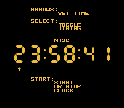
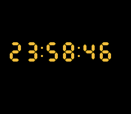

# Qalle's Clock
A 24-hour 7-segment clock for the [NES](https://en.wikipedia.org/wiki/Nintendo_Entertainment_System).

Table of contents:
* [List of files](#list-of-files)
* [Technical info](#technical-info)
* [How to use](#how-to-use)
  * [Adjust mode](#adjust-mode)
  * [Run mode](#run-mode)

## List of files

### Text
* `assemble.sh`: a Linux script that assembles the program (warning: deletes files)
* `clock.asm`: source code (assembles with [ASM6](https://www.romhacking.net/utilities/674/))

### Image
* `chr.png`: CHR data as an image (can be encoded with `nes_chr_encode.py` from [my NES utilities](https://github.com/qalle2/nes-util))
* `snap*.png`: screenshots

### Binary
* `chr.bin.gz`: CHR data in NES format (gzip compressed)
* `clock.nes.gz`: assembled program in iNES format (gzip compressed)

## Technical info
* mapper: NROM
* PRG ROM: 8 KiB
* CHR ROM: 2 KiB
* name table mirroring: vertical
* compatibility: NTSC &amp; PAL

## How to use
There are two modes.

### Adjust mode

* The program starts in this mode.
* Time does not advance.
* The clock is at the center of the screen.
* The cursor (up arrow) is visible.

Buttons:
* left/right: move cursor
* up/down: change digit at cursor
* select: toggle between NTSC and PAL timing
* start: switch to run mode (hour must be 23 or less)

### Run mode

* If using NTSC timing, time advances by one second every 60.1 frames.
* If using PAL timing, time advances by one second every 50.008333&hellip; frames.
* The clock moves around the screen to prevent burn-in.
* The cursor is hidden.

Buttons:
* start: return to adjust mode
